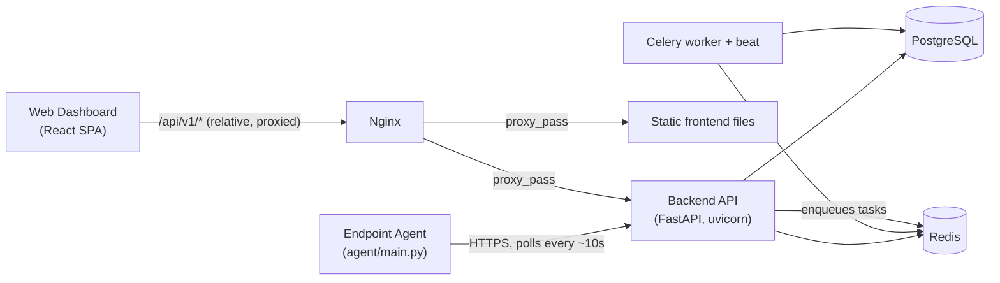

# 01 — System Architecture

## 1. Component overview

NET XDR is four independent codebases that talk to each other over HTTP:

| Component | Path | Language / stack | Runs as |
|---|---|---|---|
| Backend API | `backend/` | Python 3, FastAPI, SQLAlchemy, Alembic | `uvicorn` process |
| Background workers | `backend/` (same code) | Celery | `celery worker` + `celery beat` processes |
| Web dashboard | `netcradus-dashboard/` | React 18, TypeScript, Vite, Tailwind, Zustand | Static bundle served by nginx (prod) or Vite dev server (dev) |
| Endpoint agent | `agent/` | Python 3, psutil/watchdog/pywin32 | Long-running process on each protected device |
| Database | — | PostgreSQL 14+ | Container or managed instance |
| Cache / broker | — | Redis | Container or managed instance (optional — see §4) |
| Reverse proxy | `nginx/nginx.conf` | nginx | Container, production only |



## 2. Request flow: dashboard → backend

As of the fix in commit `53d63a2`, the frontend calls the backend through a **relative** path (`/api/v1/...`, see `netcradus-dashboard/src/api/client.ts:5`), not an absolute URL. This means:

- **Production**: nginx (`nginx/nginx.conf`) receives the request on port 80, matches `location /api/`, and proxies to the `backend` container on port 8000. Everything is same-origin from the browser's point of view.
- **Local dev** (`npm run dev`): Vite's own dev server proxies `/api` and `/health` to whatever `VITE_BACKEND_URL` points at (`netcradus-dashboard/vite.config.ts:8`, defaults to `http://127.0.0.1:8000`).

This same-origin design is deliberate — it avoids CORS entirely for the normal browser flow and keeps the httpOnly refresh-token cookie simple (no cross-site cookie rules to reason about). `ALLOWED_ORIGINS` in `.env` still matters for any client that *isn't* going through the proxy (e.g., a separately-hosted frontend, or direct API testing tools).

## 3. Authentication & session model

Implemented in `backend/app/api/auth.py` and `backend/app/core/dependencies.py`.

- **Access token**: short-lived JWT (default 15 min, `ACCESS_TOKEN_EXPIRE_MINUTES`), returned in the login response body, held in memory/localStorage by the frontend, sent as `Authorization: Bearer <token>`. Embeds `sub` (user email) and `pwd_iat` (password-changed timestamp, used to invalidate tokens issued before a password change — see `dependencies.py:62-69`).
- **Refresh token**: long-lived random token (default 30 days, `REFRESH_TOKEN_EXPIRE_DAYS`), stored **httpOnly** in a cookie scoped to path `/auth`, used only to silently mint a new access token via `POST /auth/refresh`. Rotated on every use.
- **MFA (TOTP)**: if a user has `mfa_enabled` + `totp_secret` set, `POST /auth/login` doesn't issue a real access token — it issues a short-lived (5 min) `mfa_session` JWT with `type: mfa_pending`, and the frontend must then call the MFA verification endpoint with a 6-digit code to get the real access token.
- **Every protected request** passes through `get_current_user` (`dependencies.py:20`), which: decodes the JWT, rejects non-`access`-type tokens (blocks reusing an `mfa_pending` token), checks the user is active, checks email verification **only if SMTP is configured** (`_SMTP_ENABLED` flag, `dependencies.py:17`), rejects tokens issued before the last password change, and enforces tenant-wide MFA policy if the tenant has `require_mfa=True`.

See [06-module-auth-identity-tenancy.md](06-module-auth-identity-tenancy.md) for the full walkthrough including registration and password reset.

## 4. Multi-tenancy model

- Every customer company is a **`Tenant`** row (`backend/app/models/tenant.py`), with its own `api_key` (used by agents to self-enroll under the correct tenant — see [10-module-agent-telemetry.md](10-module-agent-telemetry.md)).
- Almost every other table either has a direct `tenant_id` column or is scoped indirectly via a join to `Agent.tenant_id` (most telemetry and detection tables).
- **PlatformAdmin** and **SuperAdmin** users are cross-tenant: `User.tenant_id` is `None` for them. This is why `AuditLog.tenant_id` had to be made nullable (see [14-security-fixes-and-notes.md](14-security-fixes-and-notes.md)) — their actions aren't attributable to any single tenant.
- Tenant isolation is enforced **per-endpoint**, not by a single global mechanism (e.g., no row-level security at the DB layer) — every query handler is individually responsible for filtering by the current user's `tenant_id`. This is a real architectural risk: a missed filter is a cross-tenant data leak. One was found and fixed this engagement (`playbooks.py` manual trigger — see [14](14-security-fixes-and-notes.md)); treat any new endpoint touching tenant-scoped data with the same suspicion.

## 5. Backend directory layout

```
backend/
├── main.py                 # FastAPI app, router registration, startup seeding
├── seed.py                 # One-off local dev seeding script (roles, Default tenant, SuperAdmin)
├── requirements.txt
├── alembic/versions/       # 32 migrations — the actual source of truth for DB schema
├── app/
│   ├── api/                # 34 router modules — one per feature area, thin HTTP layer
│   ├── models/              # SQLAlchemy ORM models — one file per table (~46 tables)
│   ├── schemas/             # Pydantic request/response models
│   ├── services/            # Business logic — most of the real behavior lives here, not in api/
│   ├── core/                 # config.py (env vars), security.py (JWT/bcrypt), dependencies.py
│   │                        # (auth guard), limiter.py (rate limiting), celery_app.py, billing.py
│   └── database/db.py       # SQLAlchemy engine/session setup
└── tests/                  # api/, integration/, security/, unit/ — 8 test files total
```

**Convention**: `app/api/*.py` files should stay thin — parse the request, call a `services/` function, return the result. When you find business logic sitting directly in an `api/` handler, that's usually older code from before this convention was established; don't assume it's wrong, just be aware the codebase isn't 100% consistent here.

## 6. Frontend directory layout

```
netcradus-dashboard/src/
├── api/          # One file per backend feature area (e.g. alertsApi.ts) — all HTTP calls live here
├── pages/        # One folder per route (25 top-level pages)
├── components/   # Shared UI (layout, sidebar, topbar, etc.)
├── routes/       # AppRoutes.tsx (route table), ProtectedRoute.tsx (auth guard)
├── store/        # Zustand: authStore.ts (session state), uiStore.ts
├── types/        # Shared TypeScript types
├── hooks/, utils/, constants/
```

**Convention**: a page should never call `fetch`/`apiFetch` directly — it goes through the matching `api/*.ts` module. This is mostly followed; where it isn't (grep for `fetch(` outside `api/`), that's worth cleaning up opportunistically but isn't urgent.

## 7. Where business rules actually live

If you're trying to find "where does X get decided," these are the load-bearing files:

| Concern | File |
|---|---|
| Who can call what (roles) | `backend/app/core/dependencies.py`, per-router `Depends(...)` guards |
| Detection rule matching | `backend/app/services/rule_engine.py`, `detection_service.py`, `log_detection_service.py` |
| Playbook auto-trigger on alert | `backend/app/services/playbook_engine.py` |
| Compliance scoring | `backend/app/services/compliance_service.py` — computed live from actual DB state, not a static checklist |
| Plan limits (agent caps) | `backend/app/core/billing.py` — `PLAN_LIMITS = {"free": 10, "professional": 250, "enterprise": None}` |
| Notification dispatch + SSRF guard | `backend/app/services/notification_service.py` |
